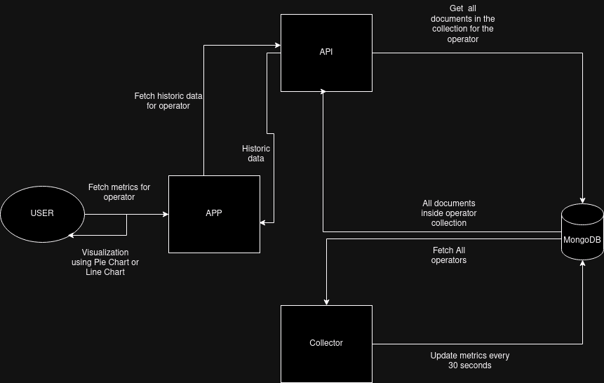

# NodeZilla
## The King of the Node Jungle.

Utilizing the power of Dune Analytics, we have developed an app that will maintain the historical data of various Operator AVS. The App allows users to view all the operator AVS, and filter the active from the in-active AVS. Users can choose to individually view the Operator's metrics and view the Total Value Locked in various states. They can choose to view historic data and see a graph of how the TVL values are trending, or visualize the current TVL state through a pie chart. The App also exports an API with documentation on how to use it. Any developer can use the API to fetch operator metadata + the historic metric data over some time. 
The historical data gets updated every 30 seconds using a data pipeline, which the user can then update on their app. The API also exports a WebSocket connection to allow the user to **subscribe** to changes for a particular operator address.

## Sections:

This contains a description of the project, the problems faced etc.
If you wanted to visit other sections navigate here:

1. API doc
2. Locahost Setup

## What it does

NodeZilla provides a way for users to view Metrics of Operators in Real-Time. It marks the operator AVS as active, and inactive and allows the users to filter them from each other. It also allows the user to open up a Operator AVS and visualize it's metrics. 
There are two options to do so, a **Line Chart** to visualizez the TVL locked metrics as historical data, and a **Pie Chart** to visualize the current state of the operator AVS.

The app also exports an API at the route [https://nodezilla.onrender.com/](https://nodezilla.onrender.com/), and the docs at [docs](https://nodezilla.onrender.com/docs). It's free to use for now, we haven't added a credit limit since it usually queries a **GET** request to the database.

The app has a collector module that keeps updating the database.

## Technologies Used

1. Next.js
2. FastAPI
3. MongoDB
4. ChartJS
5. Dune analytics

## Bounty Usage

We used **DUNE Analytics** to maintain historical data of various Operator AVS and provide a path for other developers to fetch the historical data. The data gets updated every 30 seconds and is available using the API. I've also maintained a web socket connection so that users can subscribe to updates on an operator's address.

The Puffer Finance bounty is the app to visualize the metrics both over time and the current state. The app supports real-time updates and classifies the Nodes as active or inactive. I've also maintained an API, with relevant docs to use it. And maintained historical data for a period of time.

## General Application Architecture

The app has three modules: ( Frontend, API, Collector )

1. Frontend: A Next.js APP that fetches the list of operators with their metadata, and allows the user to view and analyze each operator individually. It visualizes the Historical data for the Operator as a Line Chart and the current state as a Pie Chart.

2. API: A FastAPI constructed API that supports REST pattern and a websocket connection to subscribe to operator address changes. This interacts with the MongoDB database to fetch operators, and their respective metrics over a period of time.

3. Collector: This is a python module that utilizes the Dune API Eigen Layer preset to fetch operator metadata, update them and fetch metrics of Operator nodes using their address. It refreshes all the **active** nodes every 30 seconds. Thus keeping the MongoDB storage up-to-date.

## Challenges we ran into

#### Dune API working weirdly

- The DUNE API wasn't returning the metric for each operator as expected. This caused a blocker initially, since I was trying to maintain and gather as much data as possible. I got on call with Jackie from the Dune Team to resolve this.

#### Making a Data Module

- Since everything has a rate limit we cannot keep making fetch requests and post requests to the Dune DB or the MongoDB. I had to carefully introduce sleep timers whereever necessary without losing functionality.

#### FastAPI WebSocket connection

- This was the most trouble-sum as the app kept going into freeze mode whenever someone made a proper connection. I had to somehow resolve it, it's still in beta phase.

## What's next for NodeZilla

1. First step would be introducing Credits to rate-limit the API that is free to-use for now.

2. Creating fully function notification system using Kafka to allow people to get notifications about a Node's health on their Email.

3. Analyzing the data collected using Machine Learning Models.

## Caveats

1. Proper notification system is pending.
2. System relies on Dune API purely, it could use a hybrid to use the Dune API rather smartly.
